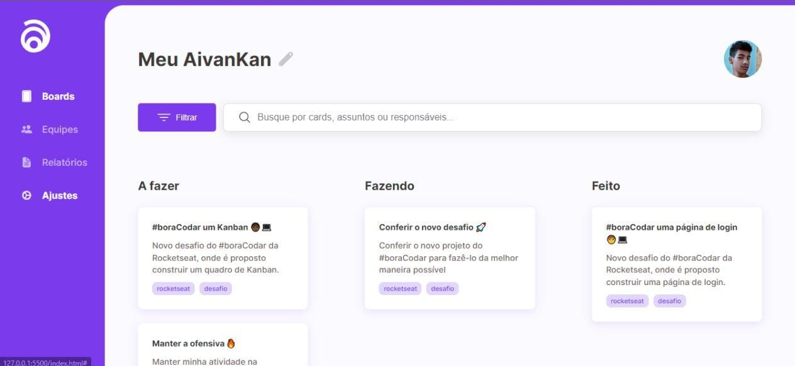

# AivanKan

O projeto AivanKan, foi desenvolvido atrás de um evento que rola toda semana na plataforma da Rocketseat, o #BoraCodar.

O projeto tem como objetivo, ajudar o cliente a se organizar nas suas tarefas, desde tarefas do trabalho, de casa ou até mesmo do ambiente escolar. O projeto é capaz de mostrar quais estão feitas, a fazer ou fazendo, dando assim ao cliente, uma melhor visibilidade das tarefas.

## Demonstração

## 💻 Tech Stack:
  
  
 

## Material

https://www.figma.com/community/file/1220368226816658013

## Licença

[MIT License](https://choosealicense.com/licenses/mit/)

## Suporte

Para suporte, mande um email para ivan.rocha.0987@gmail.com ou entre em contato via whatsapp (41) 98468-5317.

## Feedback

Se você tiver algum feedback, por favor enviar para ivan.rocha.0987@gmail.com

## Autores

- [@IvanRocha](https://www.github.com/ivanrocha10)
- [@Rocketseat](https://github.com/Rocketseat)

## Projeto

  Acesse o "AivanKan" pelo QR:

  

Caso o QR não funcione, acesse <a href="https://ivanrocha10.github.io/AivanKan/">aqui</a>